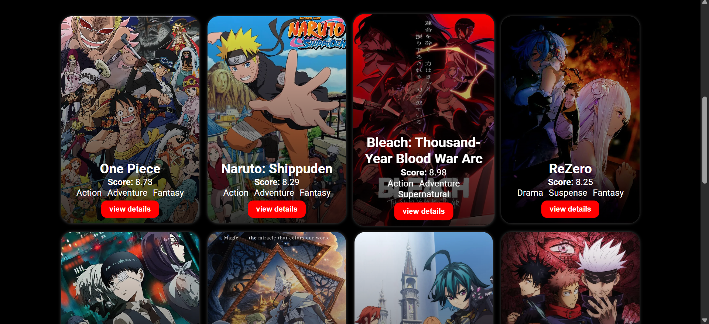
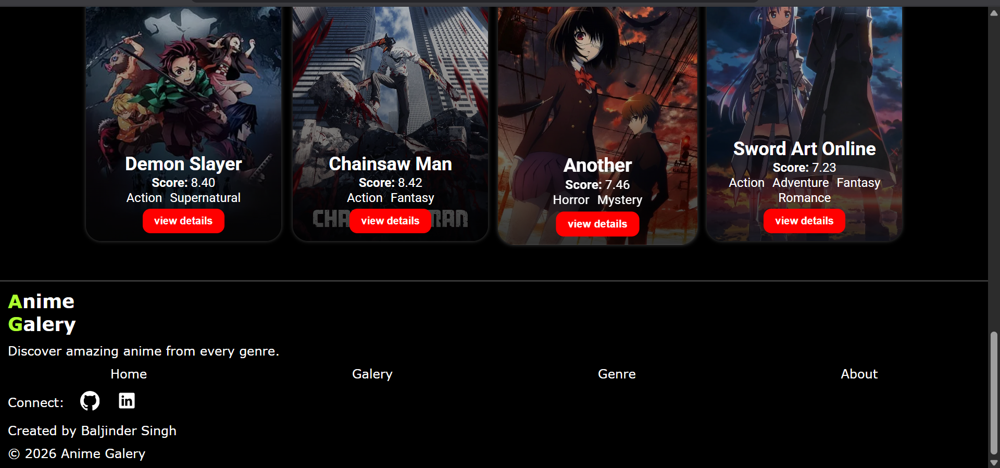
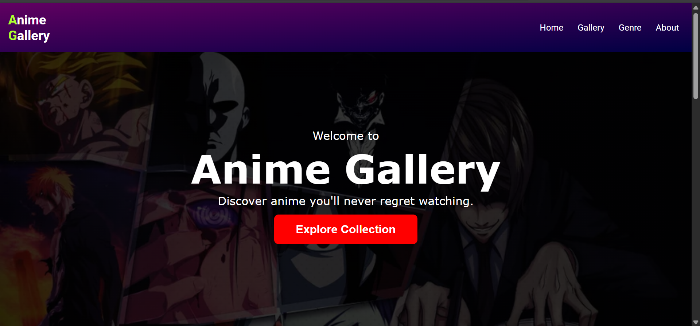

# Anime Gallery

Anime Gallery is a responsive website I built using HTML and CSS to practice frontend development and responsive design.

## Screenshots

### Hero Section

### Footer & Navigation

### Anime Showcase Section

## Features

- Responsive layout
- Hero section
- Anime gallery cards
- CSS Grid and Flexbox layouts
- Dark-themed design
- Hover effects

## Technologies Used

- HTML5
- CSS3

## Author

Baljinder Singh
